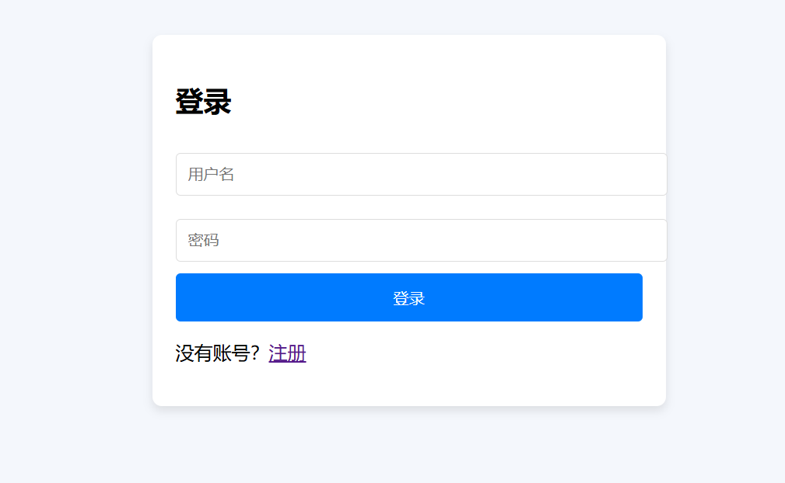
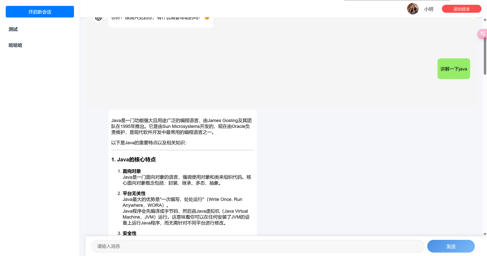

# Django 项目部署指南

## 项目初始化

### 1. 克隆项目

首先，克隆项目到本地机器：

```bash
git clone <项目的Git仓库地址>
cd <项目文件夹>
```

### 2. 创建虚拟环境

推荐使用虚拟环境来隔离项目的依赖，确保与其他项目的环境不冲突。

```bash
python -m venv venv
source venv/bin/activate  # Linux/macOS
venv\Scripts\activate     # Windows
```

### 3. 安装依赖

安装项目所需的依赖：

```bash
pip install -r requirements.txt
```

### 4. 配置数据库

确保你已经正确配置了数据库连接，可以在 `settings.py` 文件中找到相关配置，或者根据你的需求更改数据库设置。

例如，默认配置使用 SQLite，如果你使用的是其他数据库（如 PostgreSQL），需要修改以下部分：

```python
DATABASES = {
    'default': {
        'ENGINE': 'django.db.backends.postgresql',  # 使用 PostgreSQL
        'NAME': 'your_db_name',
        'USER': 'your_db_user',
        'PASSWORD': 'your_db_password',
        'HOST': 'localhost',
        'PORT': '5432',
    }
}
```

### 5. 迁移数据库

数据库迁移是 Django 使数据库与模型同步的过程。运行以下命令：

```bash
# 创建数据库迁移文件
python manage.py makemigrations

# 执行迁移
python manage.py migrate
```

### 6. 创建超级用户

为了访问 Django 管理后台，创建一个超级用户：

```bash
python manage.py createsuperuser
```

按照提示设置用户名、电子邮件和密码。

### 7. 启动项目

启动 Django 开发服务器：

```bash
python manage.py runserver
```

默认情况下，开发服务器会在 `http://127.0.0.1:8000/` 启动，你可以在浏览器中访问它。

## 常见问题

1. **数据库连接问题**

   如果出现数据库连接错误，首先检查 `settings.py` 文件中的数据库配置是否正确。确保数据库已启动，并且用户名和密码正确。

2. **静态文件未加载**

   在生产环境中，可以使用以下命令收集静态文件：

   ```bash
   python manage.py collectstatic
   ```

3. **依赖问题**

   如果安装依赖时出现错误，尝试升级 `pip` 或重新创建虚拟环境。

## 环境配置

- Python 版本: 3.x
- Django 版本: x.x.x
- 数据库: PostgreSQL (或者 SQLite)

如果有其他问题，参考 Django 官方文档：[https://docs.djangoproject.com](https://docs.djangoproject.com)


### 8. 界面展示





